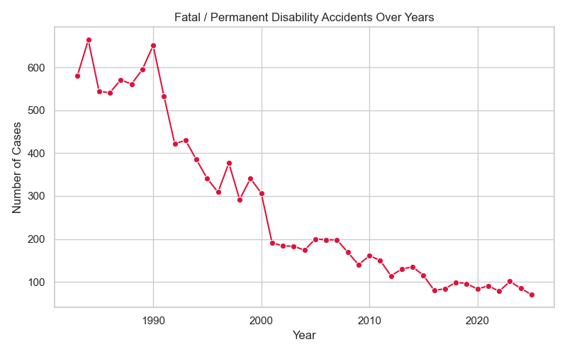

# 🛡️ Mining Safety Analytics Project
[](https://www.linkedin.com/in/mohamed-emad-396981344)
[](mailto:mohamedemad24649@gmail.com)


### Comprehensive Analysis of Mine Accident Data (OSHA)

This project explores mining accident data from **[OSHA Data Portal](https://www.osha.gov/data)**, focusing on identifying safety risks, understanding root causes, and evaluating performance across mines, contractors, and industries.  
The analysis combines **SQL**, **Python**, and **Power BI** to deliver data-driven insights for improving workplace safety.

---

## 📁 Project Structure

```
| File / Folder | Description |
|----------------|-------------|
| **/SQL/** | Contains 30+ advanced SQL queries for analytical exploration of mining safety data. |
| **/Python/** | Includes Jupyter Notebook scripts using `pandas`, `seaborn`, and `matplotlib` for generating automated charts. |
| **/Charts/** | Stores all generated visualizations as PNG files. |
| **/Dashboard/** *(in progress)* | Power BI dashboard (free version) visualizing key safety indicators interactively. |
| **data.csv** | Link and details of the OSHA dataset used. |
```

---

## 🧩 Analytical Dimensions

The analysis covers **five core safety domains:**
```
| Category | Description |
|-----------|--------------|
| 🛠️ **Risk Identification** | Accidents categorized by equipment, occupation, and mining location. |
| ⚠️ **Severity Measurement** | Tracking fatality and disability trends; average days lost. |
| 🔍 **Root Cause Analysis** | Linking accidents to activities, machinery, and worker experience. |
| 📈 **Performance Benchmarking** | Comparing safety metrics across contractors, mines, and industries. |
| ⏱️ **Safety Monitoring** | Evaluating reporting compliance and investigation timeliness. |
```

---

## 📸 Visualization Highlights

Below are sample insights extracted from the OSHA mining dataset.

### 🛠️ Risk Identification — *Top Accident-Prone Equipment*


### ⚠️ Severity Measurement — *Fatal / Permanent Disability Accidents Over Years*


### 🔍 Root Cause Analysis — *Average Days Lost by Experience Group*


### 📈 Performance Benchmarking — *Top Contractors by Accident Count*


### ⏱️ Safety Monitoring — *Immediate Reporting Compliance*


---

## ⚙️ Tools & Technologies
```
| Tool | Purpose |
|------|----------|
| **SQL Server** | Querying and aggregating OSHA data (30+ analytical queries). |
| **Python (Pandas, Seaborn, Matplotlib, OS)** | Automated chart generation and data preprocessing. |
| **Power BI (Free)** | Building interactive dashboards for management visualization. |
```

---

## 📦 Outputs

- 30+ **SQL analytical reports**
- 20+ **Python-generated charts**
- **Power BI dashboard** *(in progress)*
- All results saved automatically in `/Charts/`

---

## 🔍 Key Findings Summary

✅ Most accidents occur **underground** and involve **manual handling or maintenance**.  
✅ **Less experienced workers (<1 year)** have fewer lost days on average, but face more frequent incidents.  
✅ **Severity** is highest in **collapsing material, fall-related, and machinery-related** accidents.  
✅ **Fatalities and permanent disabilities** show a long-term **downward trend (1985–2025)**, reflecting gradual improvement in mine safety practices.  
✅ Investigation delays are generally low, with most cases starting **within 1–2 days**, indicating effective reporting protocols.  
✅ Reporting compliance varies by category, with **PARKED** and **FOUND** cases dominating, highlighting areas for improvement in lesser-reported incidents.  
✅ Significant variation exists among **mines, subunits, and contractors**, pointing to targeted intervention opportunities.  
✅ **Equipment and occupation** strongly influence risk patterns: hand tools, haulage vehicles, and maintenance roles are high-risk factors.  
✅ **Industry differences**: Coal (C) operations show higher average days lost (~37 days) compared to Metal (M) (~23–24 days), suggesting operational or exposure differences.  
✅ Accident-prone periods show **seasonal or annual fluctuations**, especially for fatal or permanent disability incidents.

---

## 💡 Recommendations

Based on the analysis, the following recommendations are suggested to improve mine safety:

1. **Targeted Training Programs**  
   - Focus on **high-risk occupations and inexperienced workers**.  
   - Include hands-on safety training for handling equipment, material movement, and maintenance tasks.

2. **Enhanced Equipment Safety**  
   - Audit and maintain **high-risk machinery and tools**.  
   - Implement protective measures for underground operations.

3. **Subunit-Specific Interventions**  
   - Underground mines should receive **priority safety monitoring and inspections**.  
   - Subunits with repeated incidents may require **re-engineering of processes or safety redesigns**.

4. **Improve Reporting and Monitoring**  
   - Ensure **timely reporting of all incidents**, including minor injuries.  
   - Standardize reporting categories to reduce **NO VALUE FOUND / UNKNOWN** cases.

5. **Contractor and Mine Performance Benchmarking**  
   - Track contractor-specific accident metrics.  
   - Incentivize **low-incident contractors** and address **high-incident performers** through targeted interventions.

6. **Predictive Safety Analytics**  
   - Use historical data trends to **anticipate high-risk activities or periods**.  
   - Implement early-warning systems for **critical risk factors**, like handling heavy material or operating complex machinery.

7. **Policy and Compliance Updates**  
   - Regularly update safety protocols in line with OSHA and industry standards.  
   - Encourage continuous improvement cycles based on **accident and investigation analytics**.

---

## 📈 Future Work

- Finalize and publish **interactive Power BI dashboard**.  
- Extend analysis to include **predictive modeling** for accident risk detection.  
- Integrate real-time data updates from OSHA API.

---

## 🧾 License

This project is for **educational and research purposes only**.  
Data source: [OSHA Data Portal](https://www.osha.gov/data)

---

### 👤 Author
**Mohamed Emad | Data Analyst**  
Data & Safety Analyst | Mining Industry  


